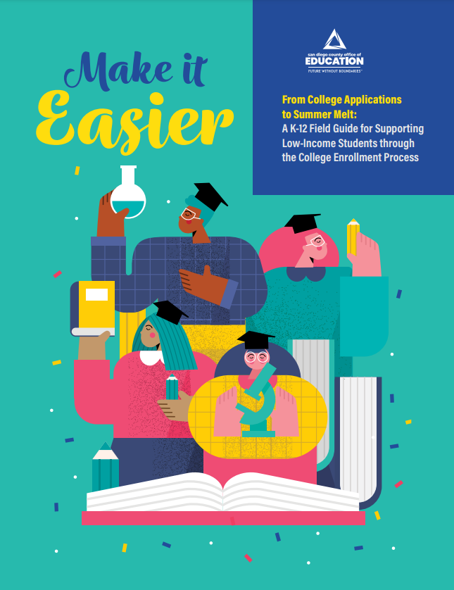
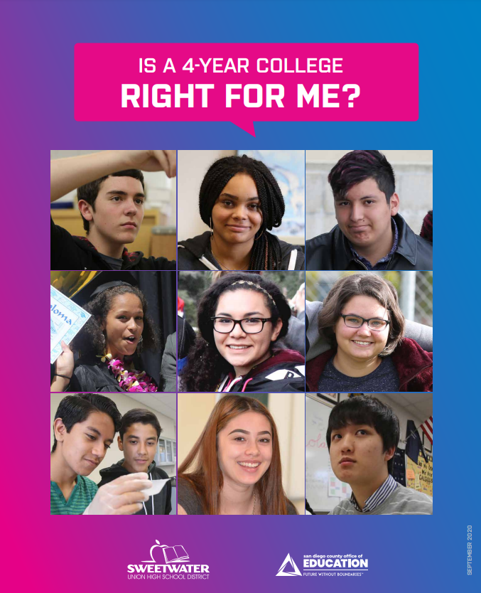
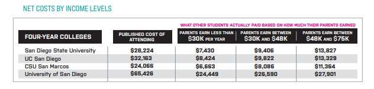
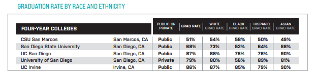
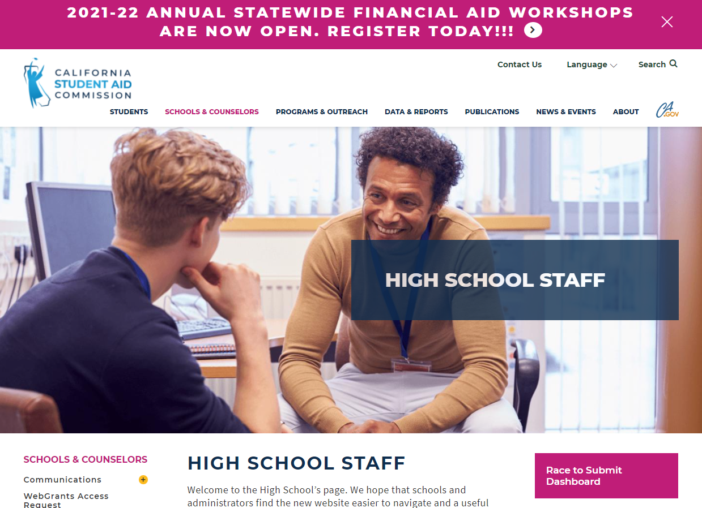
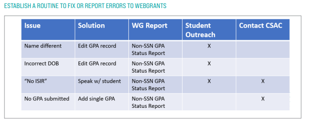
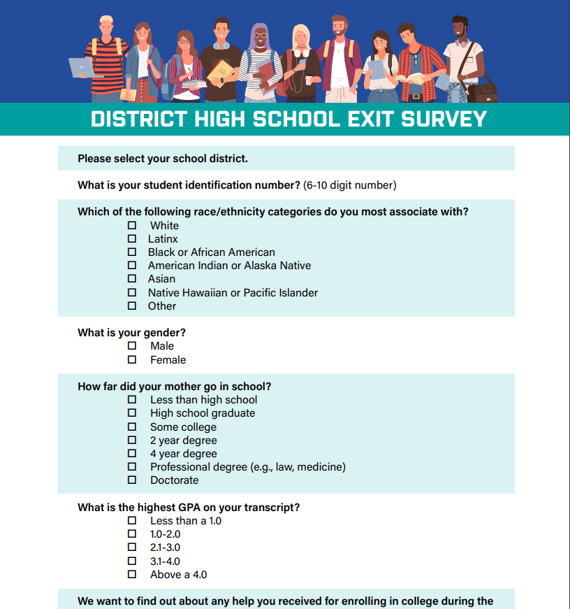

```{r meta, echo=FALSE, message=FALSE, warning=FALSE}
library(metathis)
meta() %>%
  meta_general(
    description = "Supporting college access in low income students",
    generator = "xaringan and remark.js"
  ) %>% 
  meta_name("github-repo" = "scoultersdcoe/cera_5things") %>% 
  meta_social(
    title = "Five Things School Districts Can Do to Improve College Access for Low-income Students",
    url = "https://cera2021fivethings.netlify.app",
    image = "https://github.com/scoultersdcoe/cera_5things",
    image_alt = "Title slide for CERA presentation",
    og_type = "website",
    og_author = "Shannon Coulter",
    twitter_card_type = "summary_large_image",
    twitter_creator = "@scoulte1"
  )

#xaringan::inf_mr()
#xaringan_to_pdf()
```

```{r setup, include=FALSE}
options(htmltools.dir.version = FALSE)
knitr::opts_chunk$set(warning = FALSE, message = FALSE, 
  comment = NA, dpi = 300, echo = FALSE,
  fig.align = "center", out.width = "80%", cache = FALSE)
library(tidyverse)
library(wesanderson)
library(gganimate)
library(icons)
library(xaringan)
library(xaringanExtra)

# set engines
knitr::knit_engines$set("markdown")
xaringanExtra::use_tile_view()
xaringanExtra::use_panelset()
xaringanExtra::use_clipboard()
xaringanExtra::use_webcam()
xaringanExtra::use_broadcast()
xaringanExtra::use_share_again()
xaringanExtra::style_share_again(
  share_buttons = c("twitter", "linkedin", "pocket")
)
```

name: title slide
class: inverse, title-slide
background-image: url(img/students.jpg)
background-size: cover

<br><br><br><br><br><br>
# `r rmarkdown::metadata$title`
### `r rmarkdown::metadata$subtitle`


.footnote[
#### `r rmarkdown::metadata$author`, Ph.D.
##### Director of Research and Evaluation<br>

]

???

Hi- 

My name is Shannon Coulter and I am the Director of Research and Evaluation at the San Diego County Office of Education.

Before that, I was an assistant professor at Dalton State College and the University of Tennessee. I also spent 8 years working in alternative education in San Diego.

Today I wanted to share with you some of the strategies I developed over the past 3 years

to support low-income students to access and succeed in college.

---
name: about-me
class: inverse, right, bottom


# Find me at...

`r icons::icon_style(icons::fontawesome("twitter"), scale = 1)` [@scoulte1](http://twitter.com/scoulte1)  
`r icons::icon_style(icons::fontawesome("github"), scale = 1)` [@scoultersdcoe](http://github.com/scoultersdcoe)  
`r icons::icon_style(icons::fontawesome("paper-plane"), scale = 1)` [scoulter@sdcoe.net](mailto:scoulter@sdcoe.net)

???

Here is my contact information.


---
name: guide
class: middle, center


# Make it Easier


```{r fig.show="hide", include=FALSE, easier, eval=TRUE}

```

.pull-left[
.middle[
All the tools and resources from today's presentation are publicly [available](https://resources.finalsite.net/images/v1639429972/sdcoenet/kmq4ljy195amwtiinc4w/MakeItEasier-Report.pdf) from the San Diego County Office of Education Website. 
]]

.pull-right[
```{r, ref.label= "easier", out.width="75%"}
```
]
???

You can stop listening now and access the guide, which outlines everything I'm going to talk about in this presentation.

---
name: college matters
class: center, middle

## Graduating from College Matters<br>
College graduates have 65% higher earnings compared to a high school graduate (College Board, 2013). Additionally, nearly 93% of students intend to enroll in college in 9th grade, but only 60% attend, and fewer than four in 10 earn a degree.


???

---
name: question
class: inverse, center, middle

### What prevents students from following through with their intentions to attend college and how do we support them to take the next step in the process? 


???


---
name: bottlenecks
class: center, middle

## Behavioral Bottlenecks

--

Should I get a degree . . .

--

Am I ready for college . . .

--

Am I able to fulfill the admission requirements . . .

--

Which college should I apply to and enroll . . .

--

How can I afford college . . .

--

What major should I choose . . .

--

Do I still want to go to college (summer) . . .

--

Should I stay in this college . . .

???


---
name: bottleneck 1
class: middle

### Bottleneck #1: Which college should I apply to and enroll?

----

--

.panelset[
.panel[.panel-name[Choice Conflict]

Low-income students have too many choices and decisions to make. They weigh too many factors and experience choice paralyzation.
]

.panel[.panel-name[Hurdles]
The complexity of the process discourages many from applying to more competitive colleges.
]

.panel[.panel-name[Limited Attention]
Any student only has a finite capacity for engaging in the college enrollment process due to its complexity and length. For low-income students, their attention competes with other priorities such as job schedules, taking care of siblings, and others.
]
]

???


---
name: Solution 1 & 2
class: middle, center

## [College Enrollment Guide](https://resources.finalsite.net/images/v1639430060/sdcoenet/t2an1kbx7qrhgpsqgpnh/CollegeAccess-Brochure_1.pdf)

--

.pull-left[
Use a college enrollment guide.

```{r echo = FALSE, out.width="50%"}

```
]

--

.pull-right[
```{r echo = FALSE, out.width="100%"}

```

```{r echo = FALSE, out.width="100%"}

```

Include information about college matching, list building, and fee waivers.
]

???

---
name: text campaign
class: inverse, middle, center

### Text Message Campaigns

<blockquote> Hi Peter, it’s Mrs. Thomas, your counselor. I wanted to make sure you got the Is a 4-year college right for me? guide (http://bit.ly/2AV0gJt). I’ll be sending reminders about important college app dates this month. Save the # so you know it’s me. Reply with STOP to stop receiving messages.</block quote>

--

<blockquote> Hi Peter, it’s your counselor! I know you have a lot going on. Save time by creating your list of 4-year colleges at https://cappex.com/.</block quote>

--

<blockquote> Hi Peter. I know you are the kind of person who wants to get through college. Use https://cappex.com/ to find out about college matching. It’s one of the best things to use when making your college choice. Text if you want to talk.<blockquote>

???

---
name: bottleneck 2
class: middle

### Bottleneck #2: How can I afford college?

----

--

.panelset[
.panel[.panel-name[Identity]

Low-income students who experience small hurdles in the process can cause disproportionate drop-off and create identity conflict where these students begin asking: Is college right for me?
]

.panel[.panel-name[Defaults]
Most students default to the minimum or the status quo. Many of the defaults regarding the FAFSA/Dream Act application bounce students out of process. 
]
]

???


---
name: Solution 3
class: middle, center

## [Webgrants](https://www.csac.ca.gov/webgrants-access-request)

Webgrants is a portal that provides information about the college financial aid process.
--

.pull-left[
Establish a routine to fix webgrant errors.

```{r echo = FALSE, out.width="100%"}

```
]

--

.pull-right[
```{r echo = FALSE, out.width="100%"}

```

Many students fail to qualify for financial aid because of issues with their applications.
]

???

---
name: bottleneck 3
class: middle, 

### Bottleneck #3: Do I still want to go to college?

----

--

.panelset[
.panel[.panel-name[Procrastination]

Most students experience procrastination especially during the summer, where they carry out less urgent tasks in preference to more urgent ones, and thus putting off more impending college enrollment tasks to a later time, sometimes to the “last minute” before the deadline.
]

.panel[.panel-name[Salience]
Low-income students keep the most pressing information at the forefront of their minds. Important college enrollment task my not be prioritized like other tasks such as paying an electricity bill.
]
]

???


---
name: Solution 4 
class: middle, center

## [High School Exit Survey](https://resources.finalsite.net/images/v1639430041/sdcoenet/ovz0aj1egqd9a8so01sg/MakeItEasier-DistrictExitSurvey.pdf)

--

Capture student intentions before they leave high school.

```{r echo = FALSE, out.width="75%"}

```
]

---
name: Solution 5 
class: middle, center

## [College Checklists](https://www.sdcoe.net/educators/evaluation/improvement-networks#fs-panel-2947)

--

Help students stay on-track with all the college enrollment tasks.

```{r echo = FALSE, out.width="75%"}

```
]


???

---
name: thank-you
class: inverse, left, bottom

# Thank you!

`r icons::icon_style(icons::fontawesome("github"), scale = 1)` [@scoultersdcoe](http://github.com/scoultersdcoe)  <br>
`r icons::icon_style(icons::fontawesome("paper-plane"), scale = 1)` [scoulter@sdcoe.net](mailto:scoulter@sdcoe.net) <br>
`r icons::icon_style(icons::fontawesome("laptop-code"), scale = 1)`[slides](https://cera2021fivethings.netlify.app)  
`r icons::icon_style(icons::fontawesome("code"), scale = 1)`[code](https://github.com/scoultersdcoe/cera_5things)  
